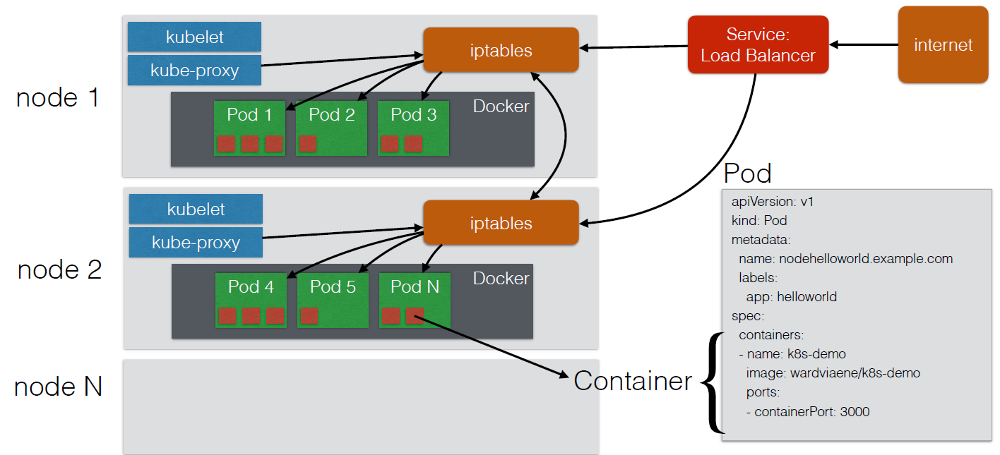

# kubernetes basic
## node architecture

* kubelet: pod를 실행
* iptables: 노드간 통신, 리눅스 방화벽, 트래빅 라우팅
* 컨테이너끼리 통신이 쉬움, 포트 번호만 알면 가능
* pod끼리는 iptable 필요함
* 서비스 => 로드밸런서를 통해 외부에서 접속 가능

## replication controller
### replication controller
* **stateless**: 어플리케이션 내에 상태 없음, 로컬과 동기화 불가 \
   -> db (방문자 정보 등을 저장하려면 db 필수) \
   수평 확장 불가, 단일 컨테이너 내 수직 확장 (CPU, 메모리)
* replication controller -> 실패하거나 삭제/종료 -> **자동 교체**
* kind를 pod -> replication controller로 변경하고, ```kubectl scale --replica n```

### replication set
* environment 설정이 가능\
    ex) "environment" == "dev" ```"dev" or "qa"```

## deployment
* 명령어 알아두면 좋음
```bash
kubectl get deployments
# Get information on current deployments
kubectl get rs
# Get information about the replica sets
kubectl get pods --show-labels
# get pods, and also show labels attached to those pods
kubectl rollout status deployment/helloworld-deployment
# Get deployment status
kubectl set image deployment/helloworld-deployment k8s-demo=k8s-demo:2
# Run k8s-demo with the image label version 2
kubectl edit deployment/helloworld-deployment
# Edit the deployment object
kubectl rollout status deployment/helloworld-deployment
# Get the status of the rollout
kubectl rollout history deployment/helloworld-deployment
# Get the rollout history
kubectl rollout undo deployment/helloworld-deployment
# Rollback to previous version
kubectl rollout undo deployment/helloworld-deployment --to-revision=n
# Rollback to any version version
```
